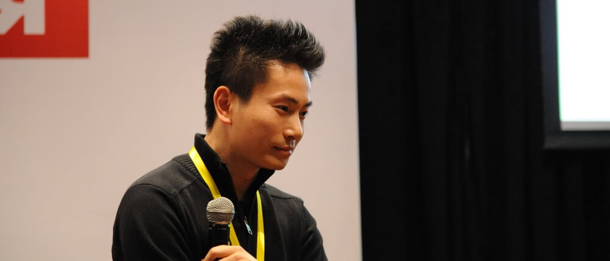
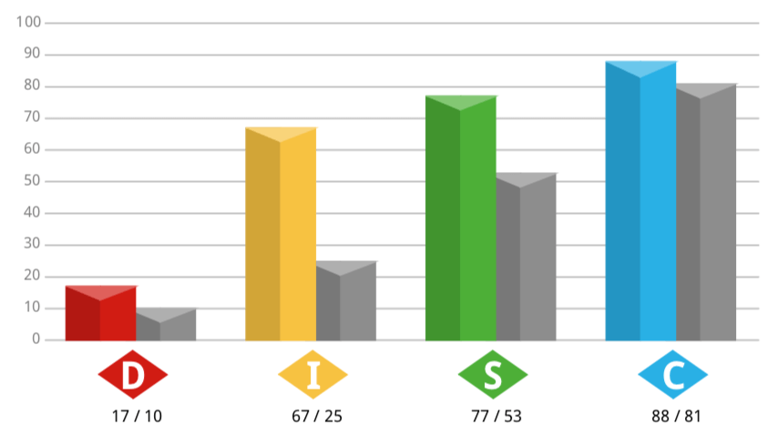
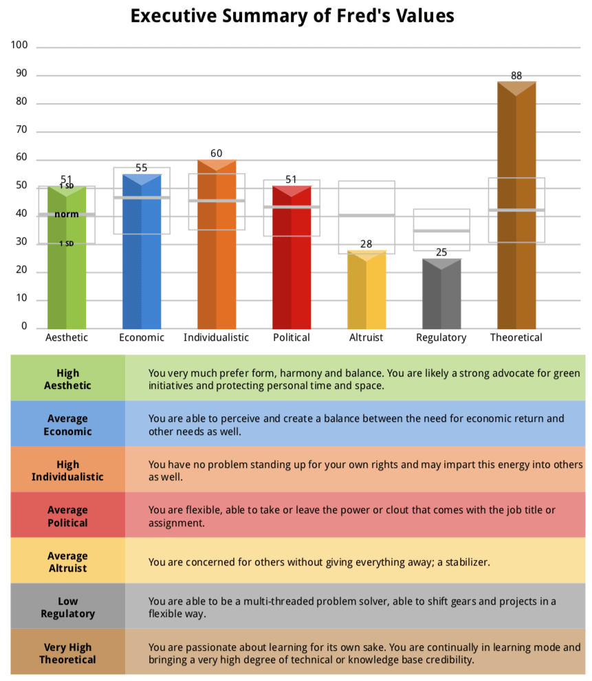

# How to Work with Fred @ Xplor

Inspired by [other senior tech leaders](https://hackernoon.com/12-manager-readmes-from-silicon-valleys-top-tech-companies-26588a660afe) in the industry, this is my version of README that hopefully gives you some insights into how to work with me more effectively at Xplor.

I am a big fan of valueing people over process, so please treat this document as a guidline only.

## Hi, I'm Fred Wu!

If you don't know me, here are a few links to get you started:

- [LinkedIn](https://www.linkedin.com/in/wufred/) for my CV
- [Github](https://github.com/fredwu/) for my code
- [Blog](http://fredwu.me/) for my thoughts
- [Flickr](https://www.flickr.com/photos/ifredwu/albums) for my photos
- [Twitter](https://twitter.com/fredwu/) for my rants

## My Leadership Style

Let's start by talking about my leadership style, as it's the cornerstone of everything I will talk about in this README.

I started working as a software engineer in 2006, and as a tech/team lead in 2011. Over the years I kept refining my leadership approach, but the foundation of it - largly due to my personality, hasn't changed.

I am a firm believer in __People__, __Product__, __Profit__, in that order. One of my top priorities is to ensure people __stay motivated__ and __stay challenged__. My goal is to work with you to find the right amount of stretch so you don't get bored and you don't get too stressed.

As part of our new employee onboarding experience, you would've been asked to do a [DISC profile](https://www.tonyrobbins.com/disc/) assessment, I'd like to share with you my DISC profile.

### My DISC Profile

You can view my full DISC profile by [downloading this PDF](assets/disc-profile.pdf).

### Key Points that Define My Leadership Style

- I value people over everything else
- I value pragmatism over correctness
- I value realism over (extreme-)optimism
- I value autonomy over micro-management
- I value over-communication over under-communication
- I value problem solving skills over engineering skills
- I value working smarter over working harder
- I value being straight-up over being political
- I value giving info early over giving info at last-minute
- I value taking risks over not making mistakes

## My Role as Head of Engineering

Allow me to repeat:

> One of my top priorities is to ensure people __stay motivated__ and __stay challenged__. My goal is to work with you to find the right amount of stretch so you don't get bored and you don't get too stressed.

That said, with the help of others, I would like:

### For Software Engineers

- to ensure you work on the right things
- to ensure you talk to the right people
- to ensure you feel it's a safe and supportive workplace
- to ensure you upskill yourself

### For Tech & QA Leads (My Direct Reports)

- to ensure you get the coaching and mentorship you need to succeed in your role
- to ensure you lead instead of manage your team
- to ensure you have the autonomy to lead and drive your team
- to ensure you have enough information and context to prioritise tasks for your team
- to ensure you feel safe to be honest with me

### For Product Managers

- to ensure you know how easy or difficult it is to perform a given task
- to ensure you always get our confidence level on our own estimation
- to ensure you get presented with alternative solutions we believe could achieve similar goals with less effort
- to ensure you are provided with enough technical guidance for your product roadmap

### For the Rest of Leadership Team

- to ensure you gain the confidence that we would deliver
- to ensure you know why we do or don't do certain things for you
- to ensure you understand how we work as an engineering group
- to ensure you are consulted before we begin a major piece of work that affects your team
- to ensure you know we work together as one Xplor team and not as individual functional groups

## Effective Communication with Me

I am generally a well organised person. In order to communicate effectively with me, please:

- be straight-up and cut the bullshit
- be explicit rathar than assume I already have the knowledge of something
- grab me if it's urgent, or requires back and forth
- call me if it's urgent and I'm out of office
- Slack me if it's short and don't require back and forth
- email me if it's long and don't require back and forth
- being interrupted is part of my role, come talk to me even if I have headphones on
- be patient, and if you don't hear back from me within a day, nudge me
- think about the outcome and actionable items before you schedule a meeting with me
- if it's more personal or more private, let's go grab a coffee or tea
- hard truth: your requests are important to you, but may not be as important compared to others

## Receiving and Providing Feedback

Feedback should be provided and received as soon as possible. Instead of waiting for our next 1:1, or the next Officevibe survey, or the next watercooler conversation, grab me and let's talk it out.

Every person is different, and therefore every project and every team are different. There is __always__ room for improvement, for __everyone__. So, if you have any feedback for me, please come talk to me, I promise I won't bite! ;)

## Trust Bank

I will always fill up the trust bank to the fullest and work backwards. What that means is that I will place my trust in you blindly, but if you repeatedly make the same mistakes again and again after being given feedback then you will slowly drain that trust bank.

## Seagull Approach 💩

If you haven't heard of this term before, [look it up](https://www.google.com/search?q=seagull+approach).

I am very passionate about certain topics such as people, pragmatism and engineering. At times I will question you, or will ask hard questions and it might feel like I'm being a seagull manager.

When that happens please don't take offence and just know that being a seagull wasn't my intention. A lot of times I do it to offer a new perspective, or to learn about things you've been working on for a while. At the end of the day, you take ownership of your work so I will always respect your approach.

## The "No Surprises" Rule

Finally, there should be no surprises in the up direction (to your leader), down direction (to your team) and sideway direction (to your peers).

Please:

- if there are issues, surface them as quickly as possible
- if you suspect something might become an issue, do some analysis and surface them as quickly as possible
- if you are told about something vague, ask for more information then do some analysis and surface them as quickly as possible

## No README is Perfect

If you have suggestions on things I should cover or clarify in this README, please come and have a chat!
